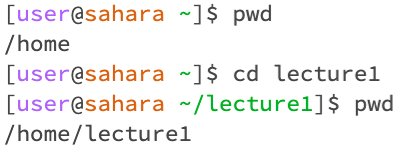
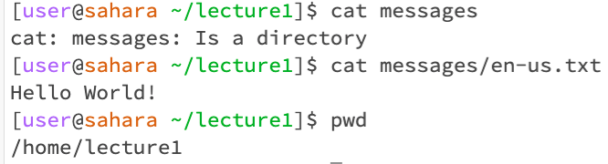

# Lab Report 1

## Assignment Prompt Questions: For each of the commands `cd`, `ls`, and `cat`, and using the workspace you created in this lab.

### 1. Share an example of using the command with no arguments.

Command `cd`:
- image:

- working directory: `/home`
- explain: After running `cd` command with no arguments, it showed nothing because we did not tell `cd` which working directory to change.
- Indicate whether the output is an error or not, and if it’s an error, explain why it’s an error: N/A

Command `ls`: 
- image:

- working directory: `/home`
- explain: After running `ls` command with no arguments, it showed us 'lecture1' because lecture1 was the next and only file in /home working directory.
- Indicate whether the output is an error or not, and if it’s an error, explain why it’s an error: N/A

Command `cat`: 
- image:

- working directory: `/home`
- explain: After running `cat` command with no arguments, it showed nothing because we did not tell `cat` which file to read and output.
- Indicate whether the output is an error or not, and if it’s an error, explain why it’s an error: There was an error after 'cat' was execute. The 'cat' kept on searching without stopping because there was not argument to search, so I had to 'Ctrl' + 'c' in order to exit.

2. Share an exmaple of using the command with a path to a directory as an argument.

Command `cd`:
- image:

- working directory: `/home`
- explain: The original working directory was `/home`. After running `cd` with a path to a directory, which is `cd /home`, the working directory stayed unchanged because `cd /home` is just `cd` working directory to the directory `/home`.
- Indicate whether the output is an error or not, and if it’s an error, explain why it’s an error: N/A

Command `ls`: 
- image:

- working directory: `/home`
- explain: After running `ls` with a path to a directory, which is `ls /home`, it showed us the file contain in `/home` was 'lecture1'.
- Indicate whether the output is an error or not, and if it’s an error, explain why it’s an error: N/A

Command `cat`: 
- image:
  

- working directory: `/home`
- explain: After running `cat` with a path to a directory, which is `cat /home`, it showed us a message saying 'cat: /home: Is a directory'.
- Indicate whether the output is an error or not, and if it’s an error, explain why it’s an error: N/A

3. Share an example of using the command with a path to a file as an argument.

Command `cd`:
- image:

- working directory: ``
- explain: 
- Indicate whether the output is an error or not, and if it’s an error, explain why it’s an error: 

Command `ls`: 
- image:

- working directory: ``
- explain: 
- Indicate whether the output is an error or not, and if it’s an error, explain why it’s an error: 

Command `cat`: 
- image:

- working directory: ``
- explain: 
- Indicate whether the output is an error or not, and if it’s an error, explain why it’s an error: 

