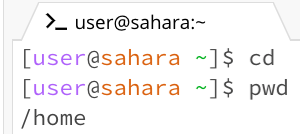
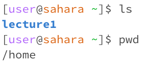
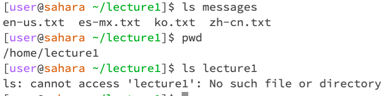
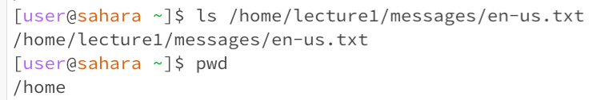

# Lab Report 1

## Assignment Prompt Questions: For each of the commands `cd`, `ls`, and `cat`, and using the workspace you created in this lab.
### The list of the files:

### 1. Share an example of using the command with no arguments.

Command `cd`:
- image:

- working directory: `/home`
- explain: After running `cd` command with no arguments, it showed nothing because we did not tell `cd` which working directory to change.
- Indicate whether the output is an error or not, and if it’s an error, explain why it’s an error: N/A

Command `ls`: 
- image:

- working directory: `/home`
- explain: After running `ls` command with no arguments, it showed us 'lecture1' because lecture1 was the next and only folder in /home working directory.
- Indicate whether the output is an error or not, and if it’s an error, explain why it’s an error: N/A

Command `cat`: 
- image:

- working directory: `/home`
- explain: After running `cat` command with no arguments, it showed nothing because we did not tell `cat` which file to read and output.
- Indicate whether the output is an error or not, and if it’s an error, explain why it’s an error: There was an error after 'cat' was executed. The 'cat' might have kept on searching without terminating, so I had to 'Ctrl' + 'c' in order to terminate the situation.

### 2. Share an exmaple of using the command with a path to a directory as an argument.

Command `cd`:
- image:
  

- working directory: `/home/lecture1`
- explain: After running `cd` with a path to a directory, which is `cd lecture1`, the working directory became `/home/lecture1`.
- Indicate whether the output is an error or not, and if it’s an error, explain why it’s an error: N/A

Command `ls`: 
- image:

- working directory: `/home/lecture1`
- explain: After running `ls` with a path to a directory, which is `ls messages`, it showed us the list of the text files contain in `messages` directory: en-us.txt  es-mx.txt  ko.txt  zh-cn.txt.
- Indicate whether the output is an error or not, and if it’s an error, explain why it’s an error: N/A. However, if we used `ls lecture1` an error message saying "ls: cannot access 'lecture1': No such file or directory" would show up because `lecture1` is a working directory.

Command `cat`: 
- image:
  

- working directory: `/home/lecture1`
- explain: After running `cat` with a path to a directory, which is `cat messages`, it showed us a message saying 'cat: messages: Is a directory'
- Indicate whether the output is an error or not, and if it’s an error, explain why it’s an error: `messages` was a directory, so there was no content to output. To `cat` out the content inside a file, we have to give a path to the file, for example, using `cat messages/en-us.txt`.

### 3. Share an example of using the command with a path to a file as an argument.

Command `cd`:
- image:
  

- working directory: `/home`
- explain: After running `cd` with a path to a directory, which is `cd /home/lecture1/messages/en-us.txt`, it showed us an error message saying 'bash: cd: /home/lecture1/messages/en-us.txt: Not a directory'.
- Indicate whether the output is an error or not, and if it’s an error, explain why it’s an error: There was an error message saying 'bash: cd: /home/lecture1/messages/en-us.txt: Not a directory' because the part of `/en-us.txt` file cannot be used as a directory.

Command `ls`: 
- image:
  

- working directory: `/home`
- explain: After running `ls` with a path to a directory, which is `ls /home/lecture1/messages/en-us.txt`, it showed us the list of the path: `/home/lecture1/messages/en-us.txt`.
- Indicate whether the output is an error or not, and if it’s an error, explain why it’s an error: N/A

Command `cat`: 
- image:
  

- working directory: `/home`
- explain: After running `cat` with a path to a directory, which is `cat /home/lecture1/messages/en-us.txt`, it showed us the text message content inside the file of 'en-us.txt' saying 'Hello World!'
- Indicate whether the output is an error or not, and if it’s an error, explain why it’s an error: N/A

